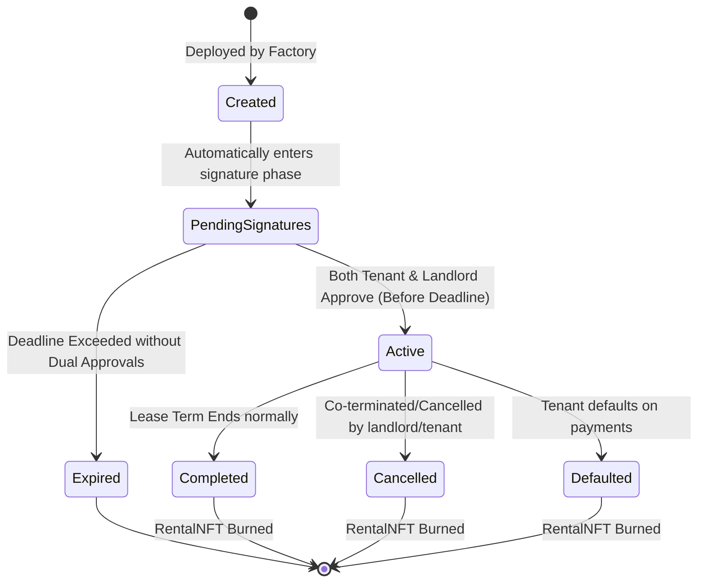
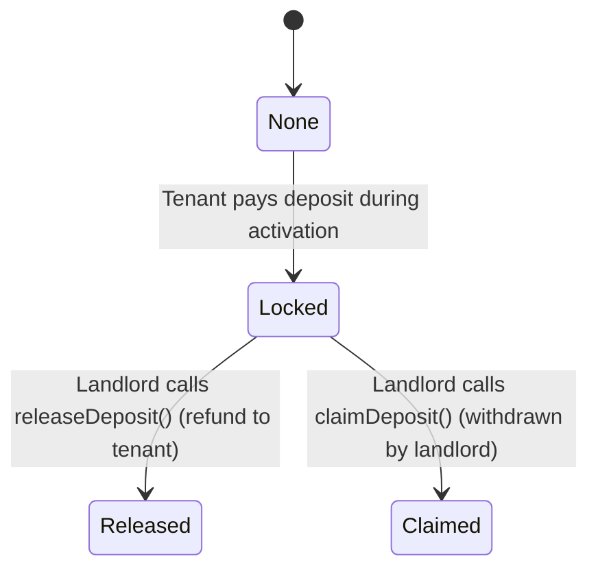

# Implementation Plan - BlockRent Smart Contracts

This document outlines the final approved architecture and implementation plan for the **BlockRent** smart contracts layer, reflecting the latest architectural revisions.

---

## 1. Assumptions & Invariants

The system is built upon the following core assumptions and invariants:

* **One-to-One Property Mapping:** One `PropertyNFT` token represents exactly one rentable real estate property.
* **Many Agreements Over Time:** A single property (`propertyId`) may have many `RentalAgreements` over its lifetime, but **only one** `RentalAgreement` may be in the `Active` state at any given time.
* **Dynamic Landownership:** The current owner of the `PropertyNFT` (`PropertyNFT.ownerOf(propertyId)`) dynamically resolves as the landlord. If ownership of the `PropertyNFT` changes during an active rental:
  - All future rent payments are escrowed for the new owner.
  - The authority to claim or release security deposits transfers to the new owner.
  - All administrative actions belong to the new owner.
* **Non-Transferable RentalNFTs:** `RentalNFT` tokens represent the temporary right to occupy a property. They are permanently owned by their deploying `RentalAgreement` and can never be transferred.
* **One NFT per Agreement:** Each `RentalNFT` contract instance represents exactly one specific `RentalAgreement`.
* **SmartLock Authorization:** Smart locks must rely exclusively on `RentalNFT.userOf(tokenId)` to authorize access.
* **Dual-Party Consent:** Agreements are non-operational until explicitly approved on-chain by both the dynamic landlord and the specified tenant.

---

## 2. Agreement Lifecycle

The diagram below details the state machine of a `RentalAgreement`:



### Terminal State Restrictions
Once an agreement enters a terminal state (`Expired`, `Completed`, `Cancelled`, `Defaulted`), all further interaction (payments, approval updates, user adjustments) must revert.

---

## 3. Detailed Architectural Designs

### A. Dual-Party Approval Flow
We recommend **On-Chain Approval Transactions** over off-chain EIP-712 signatures.
* **Rationale:** On-chain approvals (`approveAgreement()`) are simpler to audit, require no complex signature generation/nonce tracking logic in the contract, and directly link the state transition to the caller.
* **Mechanism:**
  - The landlord calls `approveAgreement()` -> sets `landlordApproved = true`.
  - The tenant calls `approveAgreement()` -> sets `tenantApproved = true` and pays the required security deposit.
  - When the second approval is registered, the agreement automatically calls its internal `activateAgreement()` function.

### B. Delayed RentalNFT Deployment & Access Control
No `RentalNFT` contract should exist for agreements that expire or are cancelled before signing:
1. `RentalAgreement` is deployed and remains in `PendingSignatures`.
2. Upon transitioning to `Active` (when both parties have approved):
   - The `RentalAgreement` deploys the `RentalNFT` contract.
   - The `RentalNFT` contract mints its single token (`tokenId = 1`) to the deploying `RentalAgreement`.
   - The tenant is set as the ERC4907 `user`.
   - Expiration is set to the lease end timestamp.
3. **Access Control:** `RentalNFT` stores the deploying `RentalAgreement` address as an `immutable` controller address:
   ```solidity
   address public immutable controller;
   
   modifier onlyController() {
       if (msg.sender != controller) revert UnauthorizedController();
       _;
   }
   ```
   Only the controller (`RentalAgreement`) can set users, update expiration, or burn the token. This avoids the overhead of `Ownable`.

### C. Pending Agreement Expiration
Agreements are initialized with a `deadline` timestamp (e.g. 7 days from creation). 
* If `block.timestamp > deadline` and the agreement is not `Active`, it transitions to `Expired` and the deposit (if partially funded) can be refunded. This prevents properties from being locked indefinitely by uncooperative tenants.

### D. Security Deposit State Machine
The security deposit state machine ensures safety and auditability:



#### Valid Transitions:
- `None` $\rightarrow$ `Locked` (Tenant funds deposit during activation).
- `Locked` $\rightarrow$ `Released` (Landlord refunds deposit).
- `Locked` $\rightarrow$ `Claimed` (Landlord claims deposit for damages/debt).

#### Invalid Transitions (Must Revert):
- `None` $\rightarrow$ `Released` or `Claimed`.
- `Locked` $\rightarrow$ `None`.
- `Released` $\leftrightarrow$ `Claimed` (Mutually exclusive terminal states).

---

## 4. Proposed Folder Structure

We will structure the `contracts` directory as follows:

```
contracts/
├── .agents/
│   └── AGENTS.md
├── contracts/
│   ├── PropertyNFT.sol
│   ├── RentalNFT.sol
│   ├── RentalAgreement.sol
│   ├── RentalAgreementFactory.sol
│   ├── interfaces/
│   │   ├── IPropertyNFT.sol
│   │   ├── IRentalNFT.sol
│   │   ├── IRentalAgreement.sol
│   │   └── IRentalAgreementFactory.sol
│   └── mocks/
│       └── MockUSDC.sol
├── test/
│   ├── PropertyNFT.test.ts
│   ├── RentalNFT.test.ts
│   ├── RentalAgreement.test.ts
│   └── RentalAgreementFactory.test.ts
├── ignition/
│   └── modules/
│       └── BlockRent.ts
├── hardhat.config.ts
├── package.json
└── tsconfig.json
```

---

## 5. Event Specifications

Every significant state change will emit an event. `RentalAgreementCreated` is enriched to support indexing:

```solidity
event RentalAgreementCreated(
    address indexed agreementAddress,
    uint256 indexed propertyId,
    address indexed tenant,
    uint256 baseRent,
    uint256 securityDeposit,
    uint256 deadline
);
```

Other events include:
- `AgreementPending()`
- `LandlordApproved(address indexed landlord)`
- `TenantApproved(address indexed tenant)`
- `AgreementActivated(address indexed rentalNFTAddress)`
- `AgreementExpired()`
- `RentalNFTDeployed(address indexed nftAddress)`
- `RentalNFTMinted(uint256 indexed tokenId, address indexed owner)`
- `PropertyMinted(uint256 indexed propertyId, address indexed owner, string tokenURI)`
- `RentPaid(uint256 indexed monthIndex, uint256 amount, uint256 lateFeeApplied)`
- `DepositLocked(uint256 amount)`
- `DepositReleased(uint256 amount)`
- `DepositClaimed(uint256 amount, string reason)`
- `LateFeeApplied(uint256 indexed monthIndex, uint256 amount)`
- `AgreementCompleted()`
- `AgreementCancelled()`
- `AgreementDefaulted()`
- `RentalNFTBurned(uint256 indexed tokenId)`

---

## 6. Verification & Testing Plan

We will write unit and integration tests covering the following scenarios:

### Core Functionality & Flows
* **Dual-Party Approval Flow:** Verify that agreement activates *only* after both landlord and tenant approve. Test that activation cannot be triggered twice.
* **Pending Agreement Expiration:** Verify that if the deadline passes before both approvals are received, the agreement transitions to `Expired` and activation fails.
* **RentalNFT Deployment Invariant:** Verify that `RentalNFT` is only deployed at activation and not before. Verify that the `RentalAgreement` is its permanent owner.
* **Dynamic Landlord Transfer:** Verify that if `PropertyNFT` is transferred to a new owner:
  - The new owner automatically gains landlord rights.
  - Escrowed funds withdrawals are sent to the new owner.
  - Deposit release/claim actions can only be executed by the new owner.
  - The old owner's attempts to call landlord functions revert.
* **Security Deposit State Machine:** Test all valid transitions and confirm that invalid transitions revert.
* **BPS Calculations:** Test that inflation and late fees calculate correctly using integer arithmetic.

To execute tests:
```bash
cd contracts
npx hardhat test
```

---

## 7. Phased Implementation Tasks

### Phase 1: Hardhat Setup & Mocks
1. `[ ]` Initialize Hardhat project inside `/contracts/` with TypeScript and OpenZeppelin contracts.
2. `[ ]` Write standard `MockUSDC.sol` contract (ERC20 with faucet).

### Phase 2: Interfaces & PropertyNFT
3. `[ ]` Write interfaces (`IPropertyNFT`, `IRentalNFT`, `IRentalAgreement`, `IRentalAgreementFactory`).
4. `[ ]` Implement `PropertyNFT.sol` using AccessControl with a restricted `MINTER_ROLE`.

### Phase 3: RentalNFT (ERC4907)
5. `[ ]` Implement `RentalNFT.sol` with immutable controller authorization instead of `Ownable`.

### Phase 4: RentalAgreement & Factory
6. `[ ]` Implement `RentalAgreement.sol` with dual-party approval logic, deadline expiration, dynamic landlord lookup, BPS inflation/late fees, deposit states, and conditional `RentalNFT` deployment.
7. `[ ]` Implement `RentalAgreementFactory.sol` to register agreements, map active rentals, and expose lookup helper methods.

### Phase 5: Verification & Deployment
8. `[ ]` Implement the extended testing suite covering all invariant, transition, and access-control checks.
9. `[ ]` Configure deployment scripts via Hardhat Ignition.
